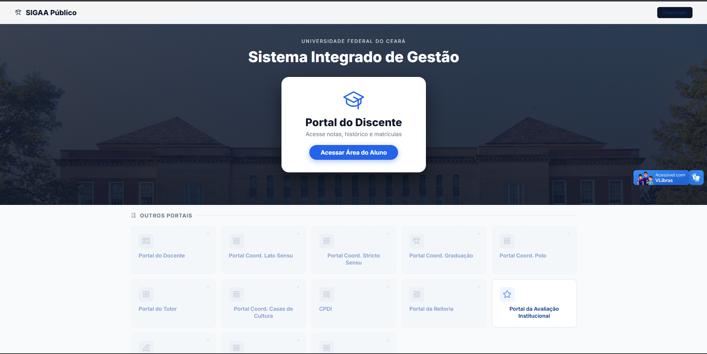
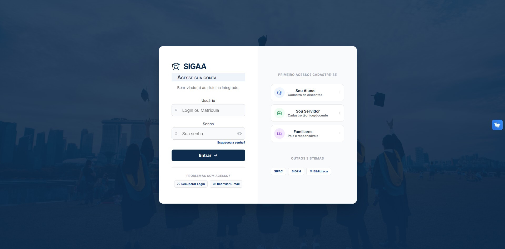
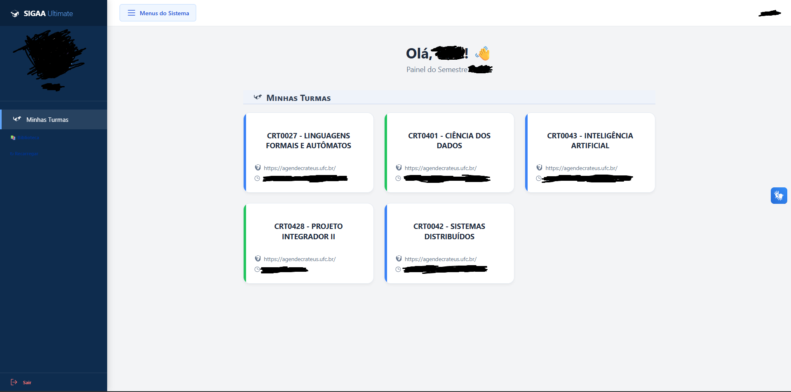

# SIGAA ULTIMATE (UFC Edition)

> Uma nova interface para o SIGAA da Universidade Federal do Ceará.

## 📖 Sobre o Projeto

Esse projeto nasceu de uma motivação simples: a interface atual do SIGAA é visualmente datada e feia.

A ideia do **SIGAA Ultimate** é aplicar uma "máscara" moderna sobre o sistema original. O script roda no navegador, reorganiza os elementos e aplica um novo design, mantendo todas as funcionalidades originais, mas com uma experiência de uso muito melhor.

**Status:** 🚧 *Em estudo e desenvolvimento contínuo.*

### 📸 O Antes e Depois

| Página Inicial | Tela de Login | Portal do Aluno |
| :---: | :---: | :---: |
|  |  |  |

## ⚙️ O que ele faz?

O projeto é dividido em 3 scripts (UserScripts) que atuam em áreas específicas:

1.  **Landing Page:** Transforma a página inicial pública, organizando os links úteis e facilitando o acesso ao login.
2.  **Login:** Moderniza a tela de entrada e remove poluição visual.
3.  **Portal do Discente:** A maior mudança. Cria uma barra lateral, organiza as turmas em cards e limpa o visual das tabelas internas.

## 🛠️ Como usar (Importante!)

Para usar, você precisa da extensão **Tampermonkey** no seu navegador.

### Passo 1: Tampermonkey
Antes de instalar, certifique-se de que seu navegador vai deixar o script rodar:

1.  Instale o [Tampermonkey](https://www.tampermonkey.net/).
2.  Se estiver usando Chrome, Edge ou Brave, vá na página de **Gerenciar Extensões**, ative o **"Modo do Desenvolvedor"** (geralmente uma chave no canto superior direito) e garanta que o Tampermonkey tenha permissão para ler e modificar dados nos sites. Sem isso, o visual não funciona!

### Passo 2: Instalação
Com tudo pronto, clique nos links abaixo e confirme a instalação:

* [Script 1: Página Inicial](https://raw.githubusercontent.com/nuvim/sigaa-ultimate/main/sigaa-landing.user.js)
* [Script 2: Tela de Login](https://raw.githubusercontent.com/nuvim/sigaa-ultimate/main/sigaa-login.user.js)
* [Script 3: Portal do Discente](https://raw.githubusercontent.com/nuvim/sigaa-ultimate/main/sigaa-portal.user.js)

> **Nota:** Os scripts funcionam em conjunto. Recomendo instalar os três para a experiência completa.

## ⚠️ Aviso

Este é um projeto pessoal, desenvolvido por um estudante. O código roda apenas no seu navegador (Client-side) e não coleta dados nem interfere nos servidores da UFC.

Caso encontre algum bug ou comportamento estranho (tipo o SIGAA travar), sinta-se à vontade para abrir uma *Issue* aqui ou desativar o script temporariamente no painel do Tampermonkey.

---
Desenvolvido por **Luiz Gusttavo**